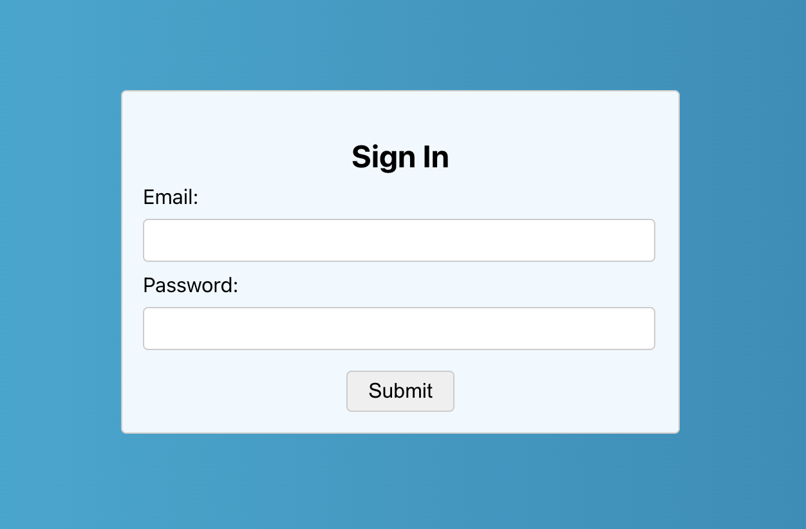

# MITxPro Mod13 - Formik Assignment

> This project is a simple React login page using Formik for input validation 

## Tech Stack

- [Create React App](https://beta.reactjs.org/learn/start-a-new-react-project)
- [Formik](https://formik.org/)

---

## How to Install

1. Clone the project repo
2. `npm install`
3. `npm start`

---

## Project Instructions:

**Your form should include the following:**

- Email field
- Password field
- Submit button

**Your form should implement the following input validation rules:**

- If the username or password inputs are empty, display the message "Field required" under the text input.
- If the username is not in an email format, display the message "Username should be an email" under the text input.
- If the username and password pass the above validations, then display the message "Login Successful" in an alert box.

**Your form should implement the following specific details:**

- The email input field should have the ID emailField
- The email error message should be within a div element that has the ID emailError
- The password input field should have the ID pswField
- The password error message should be within a div element that has an ID pswError
- The submit button should have an ID submitBtn

----

### MIT License

Copyright (c) 2023 Paul Griz

Permission is hereby granted, free of charge, to any person obtaining a copy
of this software and associated documentation files (the "Software"), to deal
in the Software without restriction, including without limitation the rights
to use, copy, modify, merge, publish, distribute, sublicense, and/or sell
copies of the Software, and to permit persons to whom the Software is
furnished to do so, subject to the following conditions:

The above copyright notice and this permission notice shall be included in all
copies or substantial portions of the Software.

THE SOFTWARE IS PROVIDED "AS IS", WITHOUT WARRANTY OF ANY KIND, EXPRESS OR
IMPLIED, INCLUDING BUT NOT LIMITED TO THE WARRANTIES OF MERCHANTABILITY,
FITNESS FOR A PARTICULAR PURPOSE AND NONINFRINGEMENT. IN NO EVENT SHALL THE
AUTHORS OR COPYRIGHT HOLDERS BE LIABLE FOR ANY CLAIM, DAMAGES OR OTHER
LIABILITY, WHETHER IN AN ACTION OF CONTRACT, TORT OR OTHERWISE, ARISING FROM,
OUT OF OR IN CONNECTION WITH THE SOFTWARE OR THE USE OR OTHER DEALINGS IN THE
SOFTWARE.
